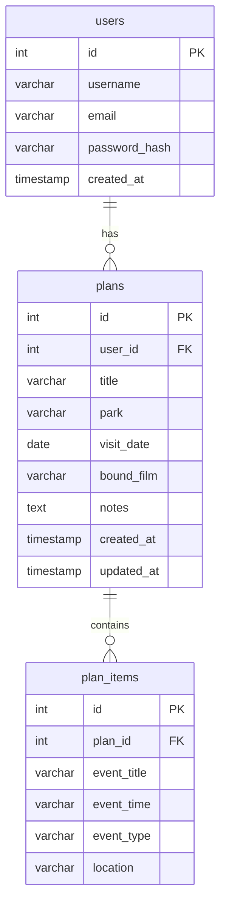

# ParkBound

Plan your day in the theme parks, dressed for the occasion.

ParkBound is a full-stack web app that pairs a park's daily lineup of shows,
parades, and character meets with the films worth "bounding" to that day. Users
register an account, browse a generated day for any park and date, and save it
as a plan they can edit and revisit.

**Live demo:** _add your deployed front-end URL here after deploying_
**API base URL:** _add your deployed back-end URL here after deploying_

---

## Tech stack

- **Front-end:** React (Vite), Context API, fetch
- **Back-end:** Node.js, Express
- **Database:** MySQL
- **Auth:** JSON Web Tokens, bcrypt password hashing
- **Validation:** express-validator
- **Testing:** node:test, supertest

---

## Project structure

```
parkbound-app/
  server/                  Node + Express API
    schema.sql             MySQL schema (users, plans, plan_items)
    src/
      app.js               Express app, middleware, route mounting
      server.js            Entry point
      db.js                MySQL connection pool
      data/parkData.js     Park catalog + day generator
      middleware/          auth (JWT) and validation helpers
      controllers/         auth, plans, days, dashboard
      routes/              auth, plans, days, dashboard
    tests/                 5 unit tests + 2 API tests
  client/                  React (Vite) front-end
    src/
      api/client.js        fetch wrapper with auth header
      context/AuthContext  global auth state + localStorage
      components/          Nav, DayCanvas, PlanItemsTable
      pages/               Auth, Planner, Plans, PlanDetail
```

---

## Local setup

You need Node.js and a running MySQL server.

### 1. Database

From the `server` folder, create the database and tables:

```bash
mysql -u root -p < schema.sql
```

Create an app user (run once in the MySQL client):

```sql
CREATE USER 'parkbound'@'localhost' IDENTIFIED BY 'parkbound_pw_123';
GRANT ALL PRIVILEGES ON parkbound.* TO 'parkbound'@'localhost';
FLUSH PRIVILEGES;
```

### 2. Back-end

```bash
cd server
npm install
cp .env.example .env     # then fill in your DB password and a JWT secret
npm run dev              # runs on http://localhost:4000
```

Confirm it is up at `http://localhost:4000/api/health`.

### 3. Front-end

```bash
cd client
npm install
npm run dev              # runs on http://localhost:5173
```

The client reads the API URL from `client/.env` (`VITE_API_URL`).

---

## Running tests

```bash
cd server
npm test
```

This runs five unit tests against the day-generator logic and two API tests
against the Express app.

---

## API overview

See `docs/API.md` for the full request and response details. In short:

- `POST /api/auth/register`, `POST /api/auth/login`, `GET /api/auth/me`
- `GET /api/parks`, `GET /api/days?park=&date=`
- `GET/POST/PUT/DELETE /api/plans` and `/api/plans/:id`
- `POST /api/plans/:id/items`, `DELETE /api/plans/:id/items/:itemId`

---

## Database design (ERD)



A user has many plans, and a plan has many plan items. Deleting a user cascades
to their plans, and deleting a plan cascades to its items.

---

## Deployment

- Front-end deploys to Netlify or Vercel. Set `VITE_API_URL` to the deployed API.
- Back-end deploys to Railway, which also hosts the MySQL database.
- Set the server's environment variables (DB connection, `JWT_SECRET`,
  `CLIENT_ORIGIN`) in the host's dashboard rather than committing them.

---

## Notes

ParkBound is a student project. Park names, schedules, shows, and events are
fictional and generated for demonstration. It is not affiliated with any real
park operator.
